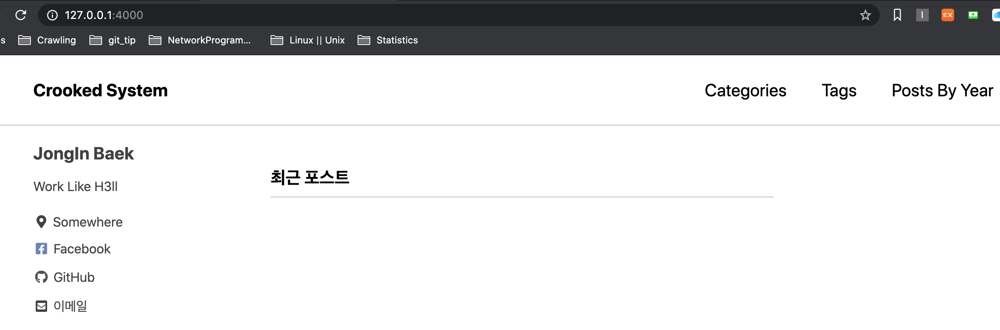
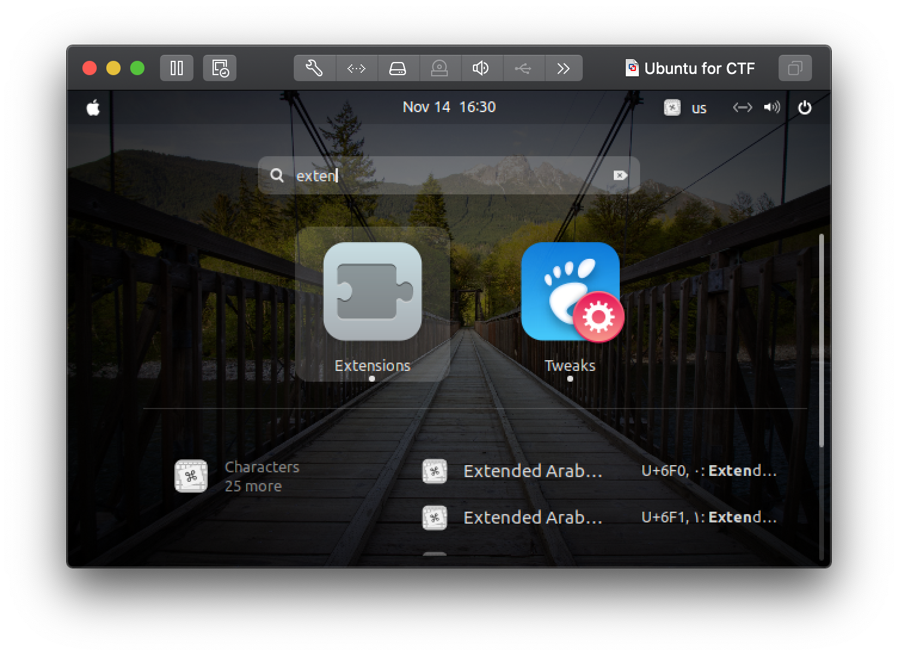
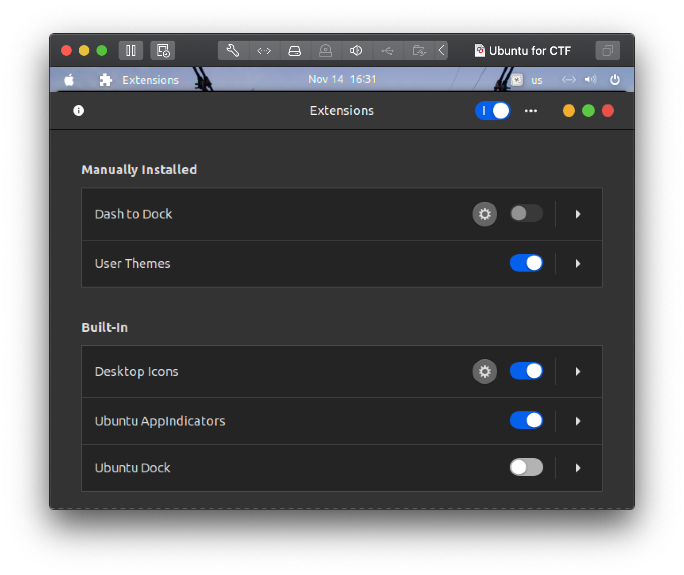

About
=====
That is my Linux(Ubuntu, Kali) and Mac OS setting.

Install
-------
In Linux

	su root
	wget https://raw.githubusercontent.com/rookedsysc/Linux_MacOS_Setting/master/debianSetting.sh
	sh debianSetting.sh

> When zsh shell is activated, enter "exit" to continue the next installation.
				
In Mac OS 
	
	wget https://raw.githubusercontent.com/rookedsysc/Linux_MacOS_Setting/master/macSetting.sh 
	sh macSetting.sh

Setting for Users 

	wget https://raw.githubusercontent.com/rookedsysc/Linux_MacOS_Setting/master/userSetting.sh
	sh userSetting.sh

> When zsh shell is activated, enter "exit" to continue the next installation.

If this error message is printed,
> [oh-my-zsh] plugin 'zsh-autosuggestions' not found

	git clone https://github.com/zsh-users/zsh-autosuggestions $ZSH_CUSTOM/plugins/zsh-autosuggestions
	source ~/.zshrc

Jekkyll 
------
Install in Ubuntu

	wget https://raw.githubusercontent.com/rookedsysc/Linux_MacOS_Setting/master/jekyllSetting.sh
	sh jekyllSetting.sh

Install in MacOS

	wget https://raw.githubusercontent.com/rookedsysc/Linux_MacOS_Setting/master/macJekyll.sh
	sh macJekyll.sh

How to start a server

	jekyll serve

KDE plasma for Kali Linux
-------
KDE plasma is a kind of Linux theme.

	
Install 
	
	apt-get install kali-defaults kali-root-login desktop-base kde-plasma-desktop
	sudo update-alternatives --config x-session-manager 
	> set kde as default

Remark
------
`F9` is a script runner

`F12` is a singlecompiler and runner

`\gd` is gtags/def 

`\gr` is gtags/ref 

If you want to tracecode you need to change to your directory of source
and enter a command , which is `gtags`. 

Setting
-------
Timezone Setting (Korea)

	sudo ln -sf /usr/share/zoneinfo/Asia/Seoul /etc/localtime

Ubuntu Dock Hide

Reference
---------
+ Vundle
https://github.com/gmarik/Vundle.vim

+ Powerline
https://github.com/Lokaltog/vim-powerline
https://github.com/Lokaltog/vim-powerline/tree/develop/fontpatcher
https://github.com/Lokaltog/powerline-fonts

+ Unite/unite-gtags
https://github.com/Shougo/unite.vim
https://github.com/hewes/unite-gtags

+ Follow lokihardt
https://github.com/l0kihardt/vimrc
